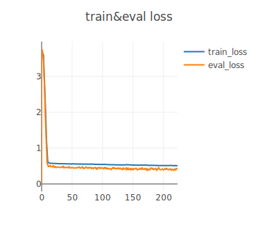
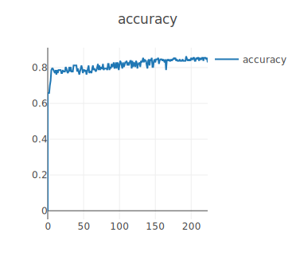
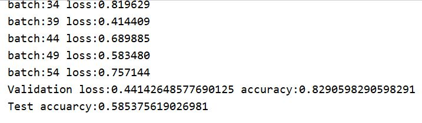

# DiffPool
## Introduction
This is a reproduction of *Hierarchical graph representation learning with differentiable pooling*.

由于我并未看懂原文中作者的架构，所以我就自己搭了一个架构，并使用了一层的Diff_Pool来对图进行坍缩。
## Requirements
* pytorch 1.7
* torch_geometric 1.6.3
## Experiment
模型在D&D数据集上进行训练和测试。

学习曲线如下所示：

精度曲线如下所示：

模型在测试集上准确率如下所示：

模型的泛化能力有点差，但是并没有出现过拟合的现象。我并没有在GraphSAGE网络中添加了normalization，或许可以添加normalization来提高模型的泛化能力。

模型在验证集上的最高准确率达到85%。
## Runing the code
训练模型`python main.py`
